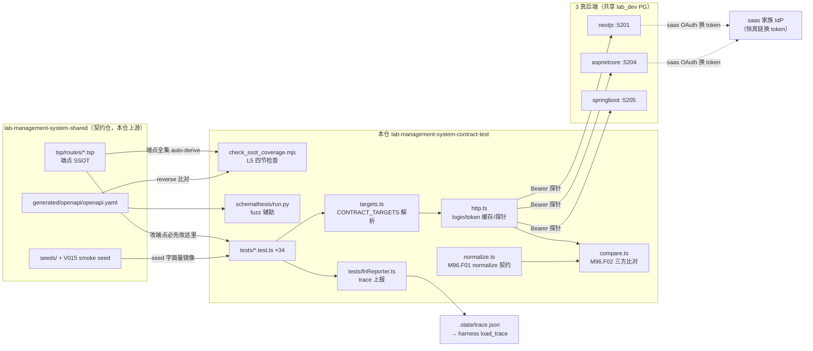
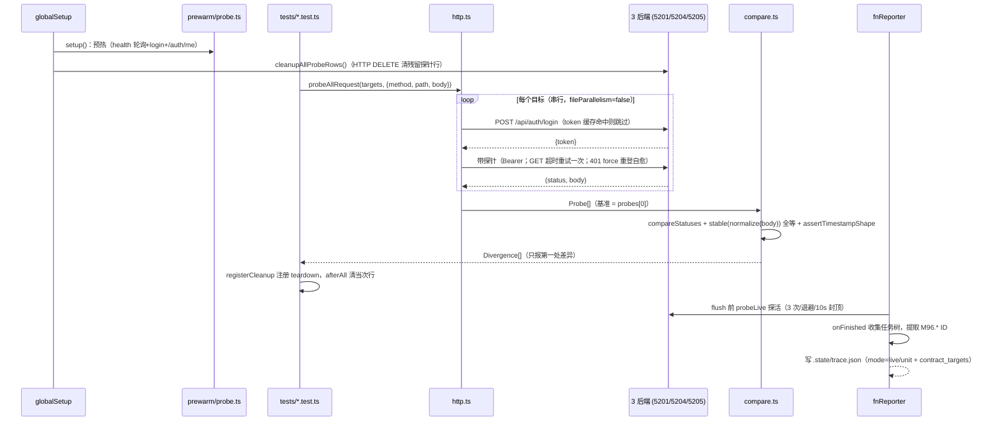

# lab-management-system-contract-test 架构

> 一句话定位：lab-management-system 家族的契约一致性验证仓——黑盒 HTTP 打 3 个真后端（nextjs / aspnetcore / springboot），断言它们「对前端不可区分」；TypeScript + vitest 实现，由 suite harness 门禁与书稿案例双消费。

生成日期：2026-09-22 ｜ 锚定 HEAD：73effdb ｜ 生成方式：DeepWiki 风格架构扫描

## 1. 总览

- **定位与职责**：家族 6 角色中的 **contract-test**。同一份 shared 契约被多后端各自实现，本仓对每个后端跑同一组探针，验证「同输出」= 前端不可区分（判定 = status 全等 + schema 校验 + `normalize()` 后全等）。它回答「哪里不一致」，后端自己的测试回答「为什么」。不是 E2E（不开浏览器），也不是后端单测搬家。
- **技术栈**：TypeScript 5.7 + vitest 2.1 + axios 1.19 + tough-cookie 5.1（`axios-cookiejar-support` 桥接，工作在 HTTP 层不受 fetch 屏蔽 HttpOnly 限制）；Node >= 20；辅助 fuzz 用 Python schemathesis 4.27.3（`schemathesis/`）。npm 依赖一律走 registry.npmmirror.com。
- **保留命名空间 `M96`**（lab 家族 infra 段），功能清单唯一锚点 `docs/functions/function-tree.md`；与 saas-identity-platform-contract-test 的 M96 同角色同编号，本仓由后者派生（参照实现）。
- **规模速览**：`src/` 11 个模块 1027 行；`tests/` 34 个 `*.test.ts` 共 4650 行（含 fnReporter.ts 223 行）；`scripts/check_ssot_coverage.mjs` 769 行；合计约 6400 行 TS/JS。覆盖 shared SSOT 全部端点（auth、contracts、summary、catalog × 4、inspection 字典 × 3 + 4 junction、param-interfaces、report-names、receipts、samples、technical-requirements、test-records、calculation-methods），端点全集 auto-derive 自 shared `tsp/routes/*.tsp`，禁止手挑。

## 2. 系统架构

关键边界：

1. **本仓 ↔ shared 契约仓**：端点清单的唯一真源是 `../lab-management-system-shared/tsp/routes/*.tsp`；L5 门（`scripts/check_ssot_coverage.mjs`）机器强制 100% 覆盖，禁止手挑。
2. **本仓 ↔ 3 后端**：纯黑盒 HTTP，端口是 conventions §6 显式字面量（`src/targets.ts`），不走 env 兜底。
3. **后端 ↔ saas IdP**：恒真链（2026-09-20 人裁）——后端登录内部走真 saas OAuth 换 token/菜单快照，saas 不可达时降级空快照（契约等价）；本仓不得假设 noop 假 token。
4. **本仓 ↔ harness**：`.harness/stack.json` 声明门禁命令与 `trace_cmd`；fnReporter 产出 `.state/trace.json` 供 harness `load_trace` + `require_live` 做假绿防御。

## 3. 模块分解

| 模块/目录 | 职责 | 关键文件 |
|---|---|---|
| 目标声明 | CONTRACT_TARGETS 解析；端口显式字面量；未知目标名抛 `TargetError`；「声明了就必须可达」 | `src/targets.ts` |
| HTTP 探针层 | login（token 按 target 缓存，401 force 重登自愈）、`probeGet`/`probeRequest`/`probeAllRequest`、GET 单发超时重试（POST/PATCH 绝不重试）、DELETE 带 body、axios 120s budget + `maxRedirects: 0` | `src/http.ts` |
| normalize 契约（M96.F01） | 日期归一到 UTC ISO、key/数组排序、null≡缺失、剔 ALWAYS_VOLATILE（token/refreshToken/jti）与 TIMESTAMP_KEYS 值；ID 保留直比（3 后端共库）；`assertTimestampShape` 独立验格式 + 年份 ∈ [1970,2100]；测试随机 tag 抹平 | `src/normalize.ts` |
| 三方比对（M96.F02） | `compareStatuses` + `compareBodies`，比对基准恒为 `probes[0]`（声明序首位）；只报第一处差异 | `src/compare.ts` |
| 探活原语 | `probeOnce`/`probeWithRetry`：N 次尝试 + 退避 1s/2s + 单针 10s 封顶，全部失败才判死，逐次留痕（池项 5.12） | `src/probe.ts` |
| 冷启动预热 | globalSetup 前置：health 轮询 + 真登录 + `/api/auth/me`；单目标 90s/合计 180s 预算；失败只警告不染色 | `src/prewarm.ts`、`tests/globalSetup.ts` |
| 共库卫生 | `cleanupAllProbeRows`（走 HTTP DELETE 清 `ct-`/`probe-` 前缀探针行，容差 200/204/404）、`uniqueName`（唯一化前缀 cap 80）、`registerCleanup`/`runCleanups`（teardown） | `src/cleanup-pg.ts`、`src/unique.ts`、`src/teardown.ts` |
| 测试辅助 | seed 字面量镜像（TENANT-001/USER-A/SP01）、`pathWithParams`（缺参抛错 fail-fast） | `src/seed.ts`、`src/path.ts` |
| 测试套件 | 34 个文件按「域 × 读/写」命名（`<area>.test.ts` + `<area>-write.test.ts`）；`describe.skipIf(!live)` 实现 unit/live 双模 | `tests/*.test.ts` |
| fnReporter + trace | 从测试名提取 `M##.F##.I##`，按 function-tree 命名空间过滤；`onFinished` 完整任务树（v5）；flush 前探活定 mode（v7）；`TRACE_MAP=1` 时写 `.state/trace.json`（schema 1 + mode + contract_targets + tests[]） | `tests/fnReporter.ts` |
| L5 SSOT 覆盖 | 四节检查：§1 forward（.tsp 全集 ↔ tests 声明）、§2 reverse（后端实现 ↔ openapi.yaml，抓私生端点）、§3 marker（last-gen-shared sha 过期）、§4 sdk-warn（前端手写 axios 模式） | `scripts/check_ssot_coverage.mjs` |
| fuzz 辅助 | schemathesis 全 method 跑 shared openapi.yaml，排除项由 shared `.tsp` 的 `// fuzz:skip` 单一修改点注入 `x-fuzz: skip` | `schemathesis/run.py`、`schemathesis/config.toml` |
| 家族一键起 | 本机起 4 后端 + live vitest（镜像 ci.yml 步骤，trap cleanup） | `scripts/start-family.sh` |

## 4. 数据流 / 请求生命周期

一轮 live 黑盒校验（`CONTRACT_TARGETS=nextjs,aspnetcore,springboot npx vitest run`）：

两个关键模式：**unit 模式**（无 `CONTRACT_TARGETS`）时 globalSetup early-return、`skipIf` 全跳、trace 全 inert——fnReporter v6 把这个「假绿」显式写成 `mode:"unit"` 交给 harness 判定，而不是静默放行；**写比对**用 `uniqueName` 前缀 + teardown + globalSetup 双层清理，因为 3 后端共用同一个 lab_dev PG。

## 5. 依赖面

- **对 shared 契约仓（`../lab-management-system-shared`）**：
  - 端点 SSOT：`tsp/routes/*.tsp` 全集（L5 forward 检查的输入）；
  - `generated/openapi/openapi.yaml`（L5 reverse 比对 + schemathesis fuzz 输入）；
  - `seeds/` + `sql/migrations/V015__smoke_seed_dict.sql`（`src/seed.ts` 镜像其字面量；改 seed 必须同仓同源）；
  - marker：`.state/last-gen-shared.json` 的 api_synced_sha 过期即 L5 FAIL。
- **对家族其他仓**：nextjs(:5201)/aspnetcore(:5204)/springboot(:5205) 三个后端进程必须已在跑（live 模式）；3 后端共享 lab_dev PG（Tailscale 远程 100.79.128.25:5432）——共库既是「ID 可直比」的物理基础，也是清理纪律的原因；后端登录链依赖 saas 家族 IdP（恒真链，saas 不可达时降级空快照）。
- **外部依赖**：无 DB 直连（守黑盒契约，清理也走 HTTP DELETE）；无第三方服务；schemathesis 需要 Python 环境（`schemathesis/requirements.txt`）。

## 6. 配置与部署

| env key | 用途 | 缺失时的行为 |
|---|---|---|
| `CONTRACT_TARGETS` | 逗号分隔声明要打的后端（`nextjs,aspnetcore,springboot`） | 空/未设 → unit 模式（只跑单元测试，探针类测试全 skip）；含未知名字 → `TargetError` 抛错 fail-fast |
| `TRACE_MAP` | fnReporter 是否写 `.state/trace.json` | 非 `1` → onFinished 直接 return，不写 trace |

无其他 env（端口/账号/health 路径全是显式字面量，硬规则「禁止 env 默认值兜底」）。gate 的 `trace_env` 由 `.harness/stack.json` 显式注入两个 key——缺 export 会导致 unit trace 被复用、`require_live` 误判。

- **端口**：5201/5204/5205（conventions §6 lab=5200 段，与 saas 家族错开）；各后端 health 路径不同（`/health`、`/actuator/health`、`/api/health`），fnReporter 与 prewarm 各持同源镜像表。
- **构建产物**：无可部署产物——本仓是测试仓，只产出 `.state/trace.json`（harness 消费）与 schemathesis 报告（`schemathesis-report/`）。
- **部署/运行方式**：本地 `npx vitest run`；家族一键 `bash scripts/start-family.sh`；CI 走仓内 `.github/workflows/ci.yml`（healthcheck 串行探测与 fnReporter HEALTH_PATHS 同源镜像，改一处必须同步另一处）。无 Dockerfile。

## 7. 质量门禁

来自 `.harness/stack.json`（`schema 1`，stack=`shared-typescript`，`require_live: true`）：

| 门 | 名称 | 命令 | 说明 |
|---|---|---|---|
| L2 | SSOT 覆盖 | `node scripts/check_ssot_coverage.mjs` | shared SSOT 有端点但 tests 无 = 红；支持 `--forward-only` |
| L3 | 类型 | `npx --no tsc --noEmit` | |
| L4 | 测试 | `npx --no vitest run` | live 需 `CONTRACT_TARGETS` + 对应后端在跑 |
| trace | 功能上报 | `npx --no vitest run` + `TRACE_MAP=1` + `CONTRACT_TARGETS=nextjs,aspnetcore,springboot` | 产出 `.state/trace.json` |

vitest 侧补强：`fileParallelism: false`（写测试与读比对共库互踩治理）、`globalSetup`（进程级一次预热+清理）、`testTimeout: 30s`（冷启动由 prewarm 在窗口外吸收）。

exit code 语义：**0** = 过；**1** = 按修复提示回代码；**2** = 契约/环境问题，停下问人。入口：suite 根目录 `python scripts/gate.py -p lab-management-system-contract-test`。
